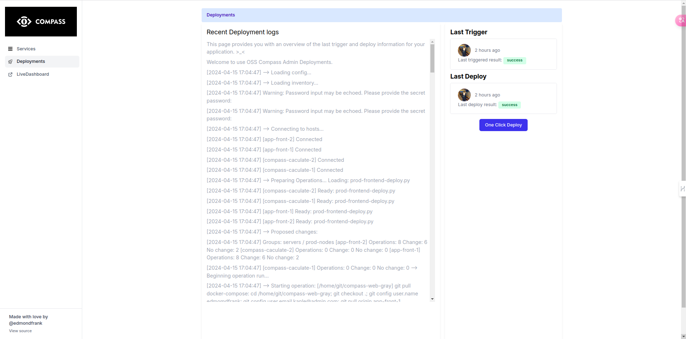

# Compass Admin Platform

Compass Admin platform: include a Prometheus exporter that provides token usage stats, Compass report stats, and other information.

## Build

1. git clone this repository at first.

```
$ git clone https://github.com/oss-compass/compass-admin
```

2. to fetch and compile all dependencies.
```
$ mix deps.get
```

3. run locally
```
$ ONLY_WEB=1 MIX_ENV=dev iex --sname app-front-apm -S mix phx.server
```

4. deploy
```
MIX_ENV=prod mix assets.deploy
MIX_ENV=prod mix release
mix deploy
```

## Preview



## Contributing
Contributions are welcome! To contribute, please follow these steps:

1. Fork the repository.
2. Create a new branch for your changes.
3. Make your changes and commit them.
4. Push your changes to your fork.
5. Submit a pull request.

## License

Under the GNU Affero General Public License v3.0. See the LICENSE file for more information.

## Acknowledgments
Thanks to the Prometheus team for providing such a great monitoring tool.
I hope this helps! Let me know if you have any further questions or need additional assistance.
